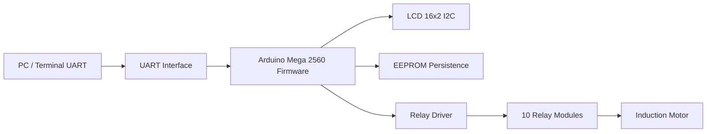
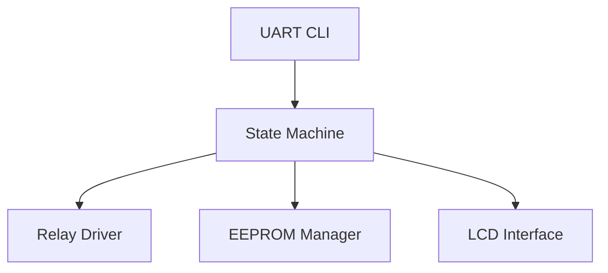

# architecture.md

# System Architecture – Relay Endurance Tester

Dokument opisuje architekturę systemu testera przekaźników oraz strukturę firmware sterownika.

Projekt składa się z trzech głównych warstw:

1. Warstwa sprzętowa
2. Firmware sterownika
3. Interfejs użytkownika

---

# Diagram architektury systemu



---

# Warstwa sprzętowa

System steruje **10 modułami przekaźnikowymi**.

Każdy moduł posiada dwa przekaźniki:

relay_i_on_off
relay_i_left_right

czyli:

10 × przekaźnik główny
10 × przekaźnik kierunku

Razem:

20 wyjść cyfrowych sterowanych przez Arduino.

---

# Sterowanie silnikiem

Silnik indukcyjny może obracać się w dwóch kierunkach:

LEFT
RIGHT

Zmiana kierunku następuje po zakończeniu cyklu.

---

# Firmware – moduły logiczne

Firmware składa się z kilku głównych komponentów.

---

# State Machine

Centralny moduł systemu.

Odpowiada za:

* logikę testu
* zmianę kierunku
* obsługę cykli
* przejścia między stanami

Stany opisane są w pliku:

state_machine.md

---

# Relay Driver

Moduł odpowiedzialny za sterowanie przekaźnikami.

Funkcje:

* relayOn(channel)
* relayOff(channel)
* setDirection(direction)

Zawiera również:

interlock bezpieczeństwa

Przekaźnik kierunku może być zmieniony tylko gdy:

relay_on_off == OFF

---

# EEPROM Manager

Odpowiada za zapisywanie stanu testu.

Zapisuje:

cycle_counter
runtime_seconds
direction
power_fail_counter

Dodatkowo przechowuje konfigurację:

STEP_DELAY
TARGET_CYCLES
MEASURE_INTERVAL

Mechanizmy bezpieczeństwa:

CRC
double buffer

---

# UART CLI

Moduł obsługi komunikacji przez UART.

Parser interpretuje komendy:

PING
STATUS
CONFIG
START
STOP
PAUSE
CONTINUE
RESET
TEST
RELEASE
SET_DELAY
SET_TARGET
SET_INTERVAL
HELP

---

# LCD Interface

Obsługa wyświetlacza LCD 16x2.

Wyświetlane informacje:

linia 1
CYC:<cycle_counter> DIR:<L/R>

linia 2
STATE:<state>

---

# Watchdog

Watchdog chroni system przed zawieszeniem firmware.

Jeżeli główna pętla programu przestanie działać poprawnie, system zostaje automatycznie zrestartowany.

---

# Przepływ danych

Diagram pokazujący zależności pomiędzy modułami firmware.



---

# Struktura firmware

Proponowana organizacja kodu:

```
firmware/
│
├── relay_tester.ino
│
├── state_machine.cpp
├── state_machine.h
│
├── relay_driver.cpp
├── relay_driver.h
│
├── eeprom_manager.cpp
├── eeprom_manager.h
│
├── uart_cli.cpp
├── uart_cli.h
│
├── lcd_ui.cpp
└── lcd_ui.h
```

---

# Główna pętla programu

Firmware pracuje w klasycznej pętli Arduino:

loop()

Schemat działania:

1. odczyt UART
2. aktualizacja maszyny stanów
3. aktualizacja LCD
4. zapis EEPROM (jeśli wymagany)
5. reset watchdog

---

# Architektura systemu

Podsumowanie warstw:

```
User Interface
    UART CLI
    LCD

Control Logic
    State Machine

Hardware Drivers
    Relay Driver
    EEPROM Manager

Hardware
    Arduino Mega
    Relay Modules
    Motor
```

---

# Dokumentacja projektu

Projekt zawiera następujące pliki dokumentacji:

README.md – opis projektu
state_machine.md – logika maszyny stanów
architecture.md – architektura systemu
