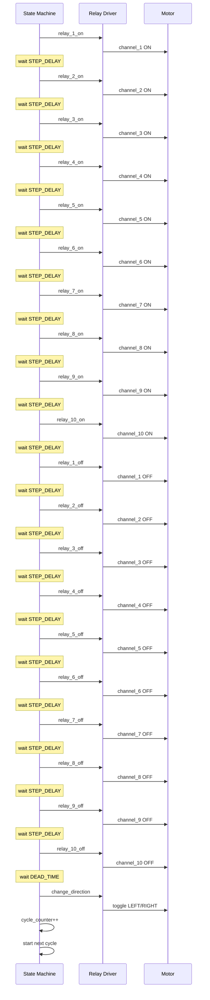

# sequence_diagram.md

# Relay Test Cycle – Sequence Diagram

Dokument opisuje dokładną sekwencję jednego cyklu testowego przekaźników.

Sekwencja pokazuje:

* załączanie przekaźników
* wyłączanie przekaźników
* dead time
* zmianę kierunku
* rozpoczęcie kolejnego cyklu

---

# Parametry testu

Domyślne wartości:

STEP_DELAY = 2000 ms
DEAD_TIME = 100 ms

Kanały:

1 … 10

---

# Diagram sekwencji cyklu

---

# Czas trwania cyklu

Dla:

STEP_DELAY = 2 s

czas jednego cyklu wynosi:

ON sequence = 20 s
OFF sequence = 20 s

razem:

≈ 40 s

---

# Szacowany czas testu

| Liczba cykli | Czas testu |
| ------------ | ---------- |
| 100 000      | ~46 dni    |
| 200 000      | ~92 dni    |
| 500 000      | ~231 dni   |

---

# Kolejność zdarzeń

Podsumowanie jednego cyklu:

1. Sekwencyjne załączenie kanałów 1 → 10
2. Sekwencyjne wyłączenie kanałów 1 → 10
3. Dead time
4. Zmiana kierunku
5. Zwiększenie licznika cykli
6. Rozpoczęcie kolejnego cyklu

---

# Zabezpieczenie kierunku

Przed zmianą kierunku spełniony musi być warunek:

relay_on_off == OFF

Zapewnia to programowy **interlock**.

---

# Dokumentacja projektu

README.md – opis projektu
state_machine.md – maszyna stanów
architecture.md – architektura systemu
sequence_diagram.md – sekwencja cyklu testowego
