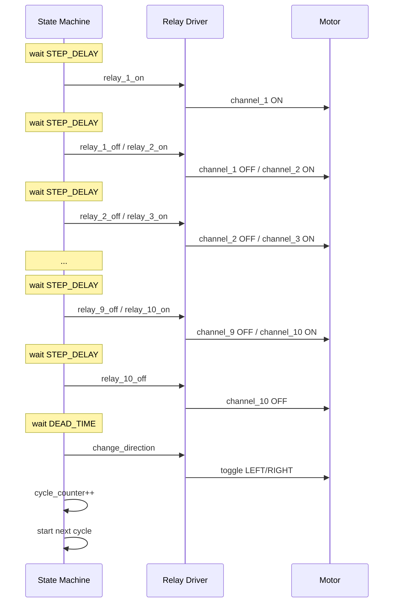

# sequence_diagram.md

# Relay Test Cycle – Sequence Diagram

Dokument opisuje dokładną sekwencję jednego cyklu testowego przekaźników.

Sekwencja pokazuje:

* załączanie przekaźników
* wyłączanie przekaźników
* dead time
* zmianę kierunku
* rozpoczęcie kolejnego cyklu

---

# Parametry testu

Domyślne wartości:

STEP_DELAY = 1000 ms
DEAD_TIME = 100 ms

Kanały:

1 … 10

---

# Diagram sekwencji cyklu

---

# Czas trwania cyklu

Dla:

STEP_DELAY = 1 s

Sekwencja wave: 11 kroków × 1 s = 11 s

(1 krok initial + 9 kroków przejścia + 1 krok wyłączenia ostatniego)

razem:

≈ 11 s

---

# Szacowany czas testu

| Liczba cykli | Czas testu |
| ------------ | ---------- |
| 100 000      | ~13 dni    |
| 200 000      | ~26 dni    |
| 500 000      | ~64 dni    |

---

# Kolejność zdarzeń

Podsumowanie jednego cyklu:

1. Załączenie kanału 1
2. Dla kanałów 2 → 10: wyłączenie poprzedniego, załączenie bieżącego
3. Wyłączenie kanału 10
4. Dead time (100 ms)
5. Zmiana kierunku
6. Zwiększenie licznika cykli
7. Rozpoczęcie kolejnego cyklu

---

# Zabezpieczenie kierunku

Przed zmianą kierunku spełniony musi być warunek:

relay_on_off == OFF

Zapewnia to programowy **interlock**.

---

# Dokumentacja projektu

README.md – opis projektu
state_machine.md – maszyna stanów
architecture.md – architektura systemu
sequence_diagram.md – sekwencja cyklu testowego
