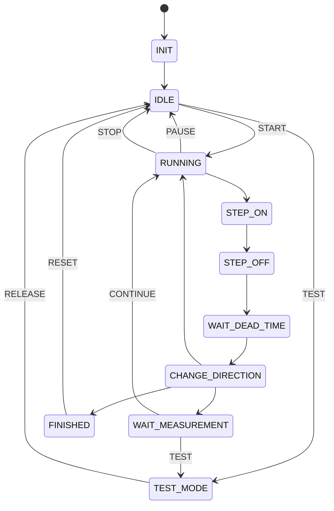

# state_machine.md

# State Machine – Relay Endurance Tester

Firmware testera pracuje jako **maszyna stanów**, która steruje sekwencją przekaźników oraz obsługuje komunikację UART.

---

# Lista stanów

STATE_INIT
STATE_IDLE
STATE_RUNNING
STATE_STEP_ON
STATE_STEP_OFF
STATE_WAIT_DEAD_TIME
STATE_CHANGE_DIRECTION
STATE_WAIT_MEASUREMENT
STATE_TEST_MODE
STATE_FINISHED
STATE_ERROR

---

# Opis stanów

## STATE_INIT

Inicjalizacja systemu:

* konfiguracja GPIO
* inicjalizacja UART
* inicjalizacja LCD
* inicjalizacja EEPROM
* odczyt zapisanych danych

Po inicjalizacji system przechodzi do:

STATE_IDLE lub STATE_RUNNING (jeśli test był w trakcie).

---

## STATE_IDLE

System zatrzymany.

Dostępne komendy:

START
TEST
STATUS
CONFIG
PING
HELP

---

## STATE_RUNNING

Główny stan pracy testu.

System wykonuje kolejne cykle przełączania przekaźników.

---

## STATE_STEP_ON

Sekwencyjne załączanie kanałów.

relay_1_on
relay_2_on
...
relay_10_on

Każde przełączenie następuje po:

STEP_DELAY

---

## STATE_STEP_OFF

Sekwencyjne wyłączanie kanałów.

relay_1_off
relay_2_off
...
relay_10_off

---

## STATE_WAIT_DEAD_TIME

Krótki czas martwy po wyłączeniu ostatniego przekaźnika.

DEAD_TIME = 100 ms

---

## STATE_CHANGE_DIRECTION

Zmiana kierunku obrotów:

LEFT ↔ RIGHT

Po zmianie kierunku:

cycle_counter++

System sprawdza:

TARGET_CYCLES
MEASURE_INTERVAL

---

## STATE_WAIT_MEASUREMENT

Test zatrzymany w punkcie pomiarowym.

Dostępne komendy:

CONTINUE
TEST
STATUS
CONFIG
PING

---

## STATE_TEST_MODE

Tryb pomiarowy przekaźników.

relay_left_right = OFF
relay_on_off = ON

Pozwala mierzyć rezystancję styków.

Wyjście:

RELEASE

Powrót do poprzedniego stanu.

---

## STATE_FINISHED

Test zakończony.

Dostępne komendy:

STATUS
CONFIG
PING
RESET

---

## STATE_ERROR

Stan błędu systemu.

---

# Diagram maszyny stanów



---

# Schemat ASCII

```
INIT
 ↓
IDLE
 ↓ START
RUNNING
 ↓
STEP_ON
 ↓
STEP_OFF
 ↓
WAIT_DEAD_TIME
 ↓
CHANGE_DIRECTION
 ↓
RUNNING

CHANGE_DIRECTION → WAIT_MEASUREMENT
WAIT_MEASUREMENT → CONTINUE → RUNNING

IDLE → TEST → TEST_MODE → RELEASE → IDLE

WAIT_MEASUREMENT → TEST → TEST_MODE → RELEASE → WAIT_MEASUREMENT

RUNNING → TARGET_CYCLES → FINISHED → RESET → IDLE
```
