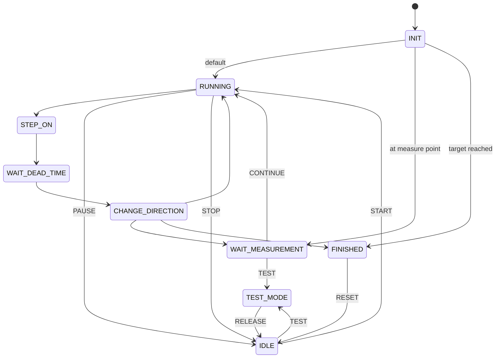

# state_machine.md

# State Machine – Relay Endurance Tester

Firmware testera pracuje jako **maszyna stanów**, która steruje sekwencją przekaźników oraz obsługuje komunikację UART.

---

# Lista stanów

STATE_INIT
STATE_IDLE
STATE_RUNNING
STATE_STEP_ON
STATE_STEP_OFF
STATE_WAIT_DEAD_TIME
STATE_CHANGE_DIRECTION
STATE_WAIT_MEASUREMENT
STATE_TEST_MODE
STATE_FINISHED
STATE_ERROR

---

# Opis stanów

## STATE_INIT

Inicjalizacja systemu:

* konfiguracja GPIO
* inicjalizacja UART
* inicjalizacja LCD
* inicjalizacja EEPROM
* odczyt zapisanych danych

Po inicjalizacji system przechodzi do:

STATE_RUNNING (domyślnie)
STATE_WAIT_MEASUREMENT (jeśli cycle_counter % measure_interval == 0 i cycle_counter > 0)
STATE_FINISHED (jeśli cycle_counter >= target_cycles)

---

## STATE_IDLE

System zatrzymany.

Dostępne komendy:

START
TEST
CONTINUE
STATUS
CONFIG
PING
HELP
RESET
FACTORY_RESET

---

## STATE_RUNNING

Główny stan pracy testu.

System wykonuje kolejne cykle przełączania przekaźników.

---

## STATE_STEP_ON

Sekwencja wave – tylko jeden kanał załączony na raz.

Krok 0:   relay_1_on
Krok 1:   relay_1_off / relay_2_on
Krok 2:   relay_2_off / relay_3_on
...
Krok 9:   relay_9_off / relay_10_on
Krok 10:  relay_10_off → STATE_WAIT_DEAD_TIME

Każde przejście następuje po:

STEP_DELAY

---

## STATE_STEP_OFF

Nieużywany. Sekwencja wave obsługiwana jest w całości przez STATE_STEP_ON.

---

## STATE_WAIT_DEAD_TIME

Krótki czas martwy po wyłączeniu ostatniego przekaźnika.

DEAD_TIME = 100 ms

---

## STATE_CHANGE_DIRECTION

Zmiana kierunku obrotów:

LEFT ↔ RIGHT

Kolejność operacji:

cycle_counter++
zmiana kierunku (DIR_LEFT ↔ DIR_RIGHT)
setDirection()
zapis do EEPROM (co save_interval cykli)
zapis do EEPROM (przy przejściu do WAIT_MEASUREMENT)

System sprawdza:

TARGET_CYCLES
MEASURE_INTERVAL

---

## STATE_WAIT_MEASUREMENT

Test zatrzymany w punkcie pomiarowym.

Przy wejściu w ten stan:

* stan jest automatycznie zapisywany do EEPROM
* gwarantuje to poprawne wznowienie po zaniku zasilania

Dostępne komendy:

CONTINUE
TEST
STATUS
CONFIG
PING
RESET
FACTORY_RESET

---

## STATE_TEST_MODE

Tryb pomiarowy przekaźników.

relay_left_right = OFF
relay_on_off = ON

Pozwala mierzyć rezystancję styków.

Dostępne komendy:

RELEASE
STATUS
CONFIG
PING
RESET
FACTORY_RESET

Powrot do STATE_IDLE przez RELEASE.

---

## STATE_FINISHED

Test zakończony.

Dostępne komendy:

STATUS
CONFIG
PING
RESET
FACTORY_RESET

---

## STATE_ERROR

Stan błędu krytycznego systemu.

W tym stanie:

* wszystkie przekaźniki są wyłączone (allRelaysOff)
* system pozostaje w tym stanie do ręcznego resetu

Wyjście ze stanu:

* komenda RESET lub FACTORY_RESET
* power cycle (wyłączenie i włączenie zasilania)

---

# Diagram maszyny stanów



---

# Schemat ASCII

```
INIT
 ↓ (default)
RUNNING
 ↓
STEP_ON  (wave: CH1→CH2→...→CH10, jeden kanał na raz)
 ↓
WAIT_DEAD_TIME
 ↓
CHANGE_DIRECTION
 ↓
RUNNING

INIT → WAIT_MEASUREMENT  (jeśli cycle_counter % measure_interval == 0)
INIT → FINISHED           (jeśli cycle_counter >= target_cycles)

CHANGE_DIRECTION → WAIT_MEASUREMENT
WAIT_MEASUREMENT → CONTINUE → RUNNING

IDLE → TEST → TEST_MODE → RELEASE → IDLE

WAIT_MEASUREMENT → TEST → TEST_MODE → RELEASE → IDLE

RUNNING → TARGET_CYCLES → FINISHED → RESET → IDLE
```
